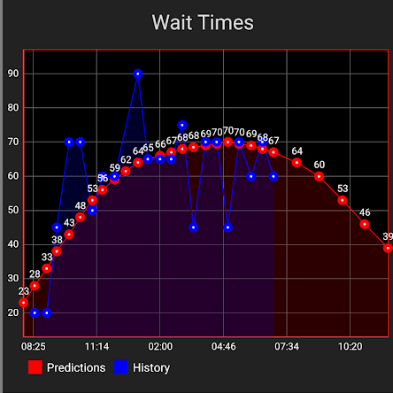

# ParkHeroML

Predicts Disneyland wait times and FastPass availability by utilizing a deep neural network regression model.  The code is part of this [Docker Image](https://hub.docker.com/r/jester565/trainfastpasses) that I run nightly to generate graphs like this:



## Running

First, populate [config.env](./config.env) with the proper configurations.  A [Dark Sky API](https://darksky.net/dev) secret and a [Google Cloud Geocoding API](https://developers.google.com/maps/documentation/geocoding/start) key must be provided.  More importantly, the model will need a lot of data.  The data I have in my database is in the [DisneyData repo](https://github.com/Jester565/DisneylandData).  After setting everything up, run the container using:
```bash
docker pull jester565/trainfastpasses
docker run --rm --env-file config.env jester565/trainfastpasses
```

## Building

To make changes to the script, simply pull this repo, make changes, and run `docker build -t traindisney .`

Use the command `docker run --rm --env-file config.env traindisney` to run the modified code. 
